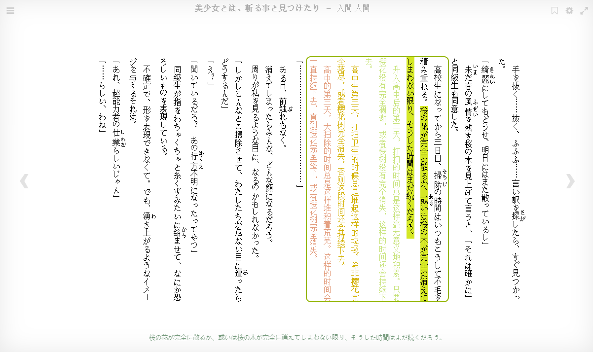

# **AnonTranslator v1.1.0**

<h3>
<ruby>千早<rt>ちはや</rt></ruby>
<ruby>愛音<rt>あのん</rt></ruby>
</h3>
A chrome extension for light novel reading

啃生肉工具，获取浏览器中的段落或句子，并复制到剪切板

**日文轻小说 - Chrome插件/扩展 - 烤肉**


---

### **插件安装**
- AnonTranslator：① 直接 [Download ZIP](https://github.com/raindrop213/AnonTranslator/archive/refs/heads/main.zip)；② Chrome打开开发者模式；③ 加载已解压的扩展程序；
- [vitsTTS整合包](https://github.com/raindrop213/AnonTranslator/releases/latest)：下载解压后打开 <kbd>RD213.bat</kbd>（注：请避免路径中含中文，放在哪里都行。原项目来自 [vits-simple-api](https://github.com/Artrajz/vits-simple-api) 。该整合包里面包含所需的vits模型([vits-uma-genshin-honkai](https://huggingface.co/spaces/zomehwh/vits-uma-genshin-honkai))。能力有限，无论如何都绕不开限制，就加了个api来桥接插件･ﾟ･(つд`ﾟ)･ﾟ･ 就是随意，能用就行）。

### **使用场景**
1. 推荐配合 [Calibre-web](https://github.com/janeczku/calibre-web) 使用（前提是你已经用 [Calibre](https://calibre-ebook.com/) 存好电子书了，最好用的书籍管理软件！！！这里放一下我的[书库](https://ebook.raindrop213.info/)）；
2. 由于主要适配 Calibre-web，别的阅读器和网站不一定能用。插件默认提取网页中  \<p\> \<h1\> ~ \<h6\> \标签。这里放一个简单好用的阅读器 [ッツ Ebook Reader](https://reader.ttsu.app)

### **使用说明**
1. 点击 <kbd>Click</kbd> 文本段落就可以朗读和复制到剪切板；
2. 方向键 <kbd>↑</kbd> 上一段 和 <kbd>↓</kbd> 下一段，并触发复制和朗读，也对应备用键位 <kbd>Num 2</kbd> 和 <kbd>Num 1</kbd>；
3. 空格键 <kbd>Backspace</kbd> 自动读书，一段接一段播放；
4. 键盘 <kbd>Num 0</kbd> 或 <kbd>F1</kbd> 触发复制和朗读当前段落；
5. <kbd>鼠标中键</kbd> 复制和朗读高亮句子；

- 要恢复初始设置则重新加载插件。
- 通过剪切板可以搭配 [LunaTranslator](https://github.com/HIllya51/LunaTranslator)（多方翻译、语素分析、快速查词、Anki；推荐！）
- ※ 机器总是会犯错的，比如本插件中的用到的deepl效果就很差，youdao限速，建议用google。目前没有任何一款翻译器能完全正确翻译，即便是GPT4也时有翻错的；注音会出错；TTS也会出错；多去理解，多多查词，这只是个复制器/复读机，让你开始去读书。

旧版本效果（LunaTranslator示例）↓↓↓

https://github.com/raindrop213/AnonTranslator/assets/53202747/32f940ad-bf29-40da-ba10-a65f1fe166d6

### **常见问题**
1. ※ 当插件设置成 <kbd>在特定网站上</kbd> 时翻译会失效！<kbd>在所有网站上</kbd> 则没问题。还有个办法是在 <kbd>manifest.json</kbd> 中的 <kbd>matches</kbd> 中硬设置使用插件的网页。如：
    ```
    "matches": [
      "http://localhost:8083/*",
      "http://127.0.0.1:8083/*",
      "https://kakuyomu.jp/*",
      "https://*.syosetu.com/*",
      "https://ebook.raindrop213.info/*",
      "https://reader.ttsu.app/*"
      ],
    ```
2. vits怎么用？ 答：打开 RD213.bat ，等小黑窗出现 127.0.0.1:23456 说明能用，使用时请挂着别关。
3. 改键位？ 答：在src/content.js里的addMouseListener函数自行修改，附 [键位对照表](https://www.ecomcn.com/Website/show_id468.html)；


### **日文资源**
1. 在线阅读：各种在线网站都可以用，如 [カクヨム](https://kakuyomu.jp/)、[小説家になろう](https://syosetu.com/)。但在 [青空文庫](https://www.aozora.gr.jp/) 上面不能正常工作，因为是纯文本，没有标签（可使用 [AozoraZip2Mobi](https://github.com/ccneko-emitan/AozoraZip2Mobi) 制作青空文库的epub）；
2. 下载党：Z-Lib就不用多说了，那你也可能还知道安娜的档案和各种DLRaw网站；
3. 电子书购买：[bookwalker](https://bookwalker.jp/)、[Amazon](https://www.amazon.co.jp/kindle-dbs/storefront) 和 [Rakuten](https://books.rakuten.co.jp/e-book/) ，其中bookwalker解锁（DeDRM）稍难点，另外两个解锁相对简单一点，搜一搜就有了。

### **开发计划**
- 提取（~~振假名、分割句子~~）
- 语音（~~WindowsTTS、VitsTTS~~）
- 翻译（~~Google、Youdao、DeepL~~、GPT接口）
- 词典（moji、weblio）
- 日本語形態素解析（MeCab）
- 联动 Anki（提一下另外写的小应用，除了普通文本内容，还能附带漫画截图：[anki-scene-memory](https://github.com/raindrop213/anki-scene-memory)）

---

